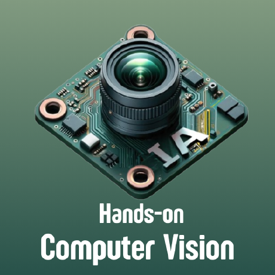

# Semillero "Hands-on Computer Vision"

  

Cada sesion del semillero se encuentra en una carpeta diferente. En cada carpeta se encuentra un archivo README.md con la descripción de la sesión y los ejercicios a realizar.