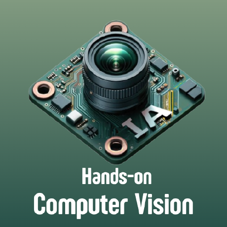

<div align="center">

# Hands-on Computer Vision

  
  <br>
  <strong>Transforma tu visión del mundo: descubre el poder y las posibilidades ilimitadas de la visión por computadora.</strong>
  <br><br>

[](https://discord.gg/MkCpdsHZzJ)
[](https://github.com/semilleroCV/hands-on-computer-vision/issues)
[](https://github.com/semilleroCV/hands-on-computer-vision/stargazers)
[](https://github.com/semilleroCV/hands-on-computer-vision/network/members)

</div>

## 🚀 Acerca del Semillero

Bienvenido al repositorio oficial de **Hands-on Computer Vision**, un semillero de investigación diseñado para explorar las fascinantes áreas de la visión por computadora a través de experiencias prácticas. Este repositorio contiene los notebooks y recursos utilizados en nuestras sesiones semanales.

## 📚 Sesiones

### 🔍 Sesión 1: Pilot
> **Introducción al semillero**
>
> Un viaje introductorio por el fascinante mundo de la visión por computadora, donde conocerás el plan de trabajo, conceptos fundamentales y configurarás tu entorno.
>
> [📖 Ver notebooks](./sesiones/sesion1)

### 📷 Sesión 2: De fotones a pixeles
> **Generalidades sobre la adquisición y procesamiento digital de imágenes**
>
> Descubre cómo la luz se transforma en información digital, explorando los principios físicos de formación de imágenes y técnicas básicas de procesamiento.
>
> 🚧 **En construcción** 🚧

### 🧠 Sesión 3: Deep Learning
> **Despierta el poder de la inteligencia artificial en la visión por computadora**
>
> Adéntrate en el fascinante mundo de las redes neuronales convolucionales y descubre cómo pueden revolucionar el análisis de imágenes.
>
> 🚧 **En construcción** 🚧

### 🌈 Sesión 4: Imágenes Espectrales
> **Conoce los secretos que hay más allá de una imagen de color**
>
> Explora dimensiones invisibles al ojo humano a través de tecnologías multiespectrales e hiperespectrales.
>
> 🚧 **En construcción** 🚧

### 🔭 Sesión 5: Estimación pasiva de la profundidad
> **Explora las técnicas de estimación de profundidad sin fuentes externas**
>
> Aprende a extraer información 3D a partir de imágenes 2D utilizando algoritmos avanzados y visión estéreo.
>
> 🚧 **En construcción** 🚧

### 📏 Sesión 6: Estimación activa de la profundidad
> **Extrayendo profundidad con precisión milimétrica a partir de la luz**
>
> Conoce las tecnologías de sensores activos que permiten mapear el mundo con precisión extraordinaria.
>
> 🚧 **En construcción** 🚧

### 🔥 Sesión 7: Asignación de proyectos
> **Rétate a ti mismo 🔥🔥**
>
> Momento de poner a prueba tus conocimientos con proyectos desafiantes que integrarán lo aprendido hasta el momento.
>
> 🚧 **En construcción** 🚧

### 🧩 Sesión 8: Segmentación
> **Delineando el mundo digital a través de píxeles clasificados meticulosamente**
>
> Aprende a dividir y entender imágenes mediante técnicas de segmentación que dan sentido a cada región.
>
> 🚧 **En construcción** 🚧

### 📊 Sesión 9: Optimización Convexa
> **Optimizando el mundo con matemáticas**
>
> Descubre cómo los principios matemáticos de optimización son el motor detrás de los algoritmos más potentes.
>
> 🚧 **En construcción** 🚧

### 🔆 Sesión 10: Imágenes térmicas
> **El mundo visto a través del calor**
>
> Explora una dimensión alternativa donde la temperatura revela información invisible a la luz normal.
>
> 🚧 **En construcción** 🚧

### 💬 Sesión 11: NLP
> **Aprendiendo a hablar con las máquinas**
>
> Conecta el mundo visual con el lenguaje mediante modelos avanzados multimodales.
>
> 🚧 **En construcción** 🚧

### 🚀 Sesión 12: Proyectos finales
> **Desafía tus habilidades 🚀 🚀**
>
> Culmina tu viaje presentando un proyecto que integre todo lo aprendido durante el semillero.
>
> 🚧 **En construcción** 🚧

## 🛠️ Cómo utilizar este repositorio

### Requisitos previos

- Python 3.8 o superior
- Visual Studio Code (con extensiones para Python y Jupyter)
- Conocimientos básicos de programación

### Instalación

1. Clona este repositorio:
   ```bash
   git clone https://github.com/semilleroCV/hands-on-computer-vision.git
   cd hands-on-computer-vision
   ```

2. Crea un entorno virtual:
   ```bash
   python -m venv venv
   source venv/bin/activate  # En Windows: venv\Scripts\activate
   ```

3. Instala las dependencias:
   ```bash
   pip install -r requirements.txt
   ```

4. Abre el proyecto en VS Code:
   ```bash
   code .
   ```

## 👥 Comunidad y Soporte

- **Discord**: Únete a nuestra comunidad en [Discord](https://discord.gg/MkCpdsHZzJ) para discusiones, preguntas y soporte.
- **Issues**: Si encuentras errores o tienes sugerencias, por favor crea un [issue](https://github.com/semilleroCV/hands-on-computer-vision/issues).

## ✨ Contribuciones

¡Las contribuciones son bienvenidas! Si deseas mejorar los notebooks, corregir errores o añadir ejemplos, no dudes en crear un Pull Request.

---

<div align="center">
  <p>© 2025 Made by Students ❤️ 👋</p>
</div>
